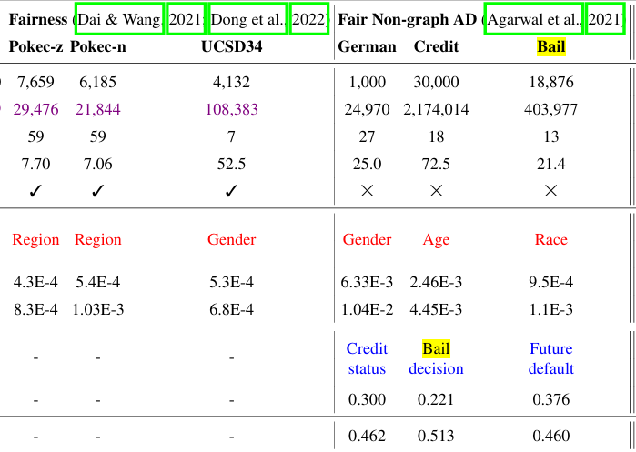
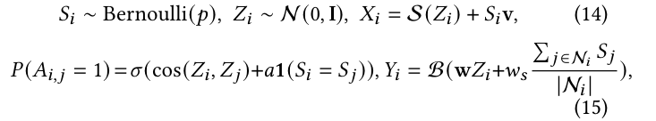

# Fair-GAD Preprocessing

## Dataset 

 from FairGAD(2024)
##
Pokec: 
- source paper: https://arxiv.org/pdf/2009.01454
- repo: FairGNN  https://github.com/EnyanDai/FairGNN
sampled from https://snap.stanford.edu/data/soc-Pokec.html

<!-- Bail, Credit, German:
- source paper: https://arxiv.org/pdf/2108.05233 (Dong et al. 2022)
    https://arxiv.org/pdf/1102.2166 (2012)
- repo: EDITS https://github.com/yushundong/EDITS

(感觉论文部分引用反了)

German
- source paper: https://arxiv.org/pdf/2102.13186 (2021)
- repo: NIFTY https://github.com/HongduanTian/NIFTY -->

UCSD34:
- repo: https://networkrepository.com/socfb-UCSD34.php

Synthetic: 

- source paper: https://arxiv.org/pdf/2201.03662